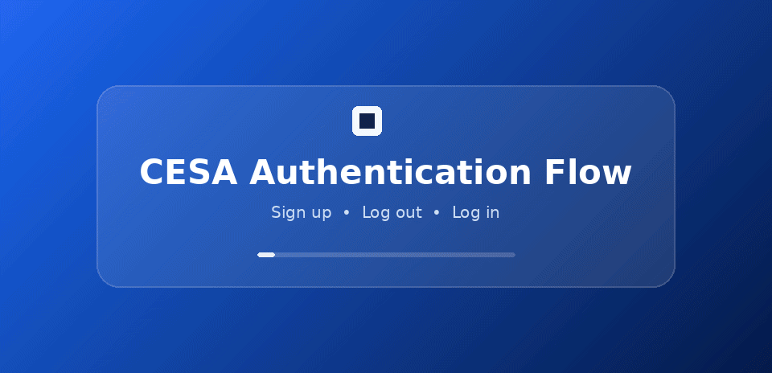
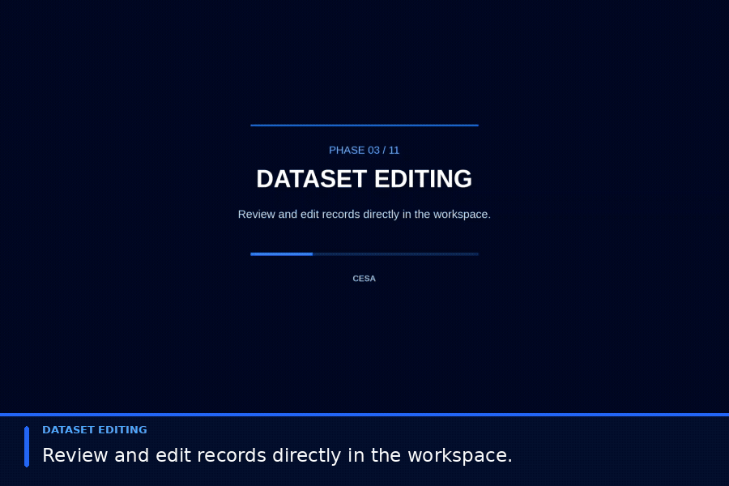
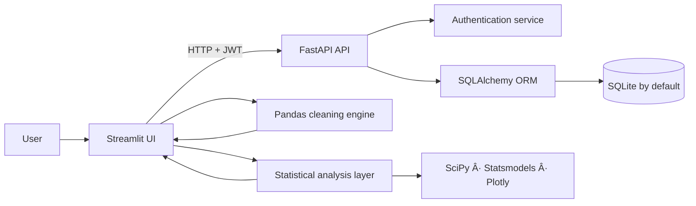

<div align="center">
  

# CESA

**A full-stack application for creating, cleaning, managing, and statistically analysing structured datasets.**
</div>
CESA connects the complete data workflow inside one interface:

```text
Create or upload → Profile → Clean → Generate form schema → Edit → Analyse → Export
```

Users can create a dataset from scratch or upload an existing file, configure reproducible cleaning rules, generate a schema-aware data-entry form, manage records, run guided statistical analyses, and export the final dataset.

---

## Why CESA?

Real data work rarely consists of one isolated cleaning script or one chart. A useful workflow must preserve the dataset structure while connecting ingestion, validation, transformation, editing, analysis, and persistence.

CESA brings those stages together through:

- a polished **Streamlit** interface;
- a secured **FastAPI** backend;
- a configurable **Pandas** cleaning engine;
- **SQLAlchemy** persistence;
- guided statistical analysis with **SciPy**, **Statsmodels**, **Plotly**, and **Matplotlib**;
- JWT authentication and user-scoped dataset access.

---

## Core capabilities

| Capability | What CESA provides |
|---|---|
| Flexible data ingestion | Create a dataset from scratch or upload `.xlsx`, `.xls`, `.csv`, and `.tsv` files. |
| Schema-aware cleaning | Infer column types and configure null handling, text transformations, boolean normalisation, categorical preparation, multi-hot encoding, formula-based values, and numeric outlier treatment. |
| Safe formula engine | Build numeric, boolean, and text values from other columns through an AST-based allow-listed evaluator without Python `eval()`. |
| Dynamic form generation | Convert dataset metadata into typed text, number, date, checkbox, radio, and select controls. |
| Dataset workspace | Add records, search, filter, edit cells, save changes, reload persisted data, and export to Excel. |
| Guided analytics | Explore overview, univariate, bivariate, three-variable, multivariate, regression, and hypothesis-testing workflows. |
| Secure persistence | JWT authentication, hashed passwords, user-scoped datasets, environment-based secrets, and SQLAlchemy persistence. |

---

# Interactive application demonstrations

The demonstrations below show complete CESA workflows rather than isolated interface screenshots. Each GIF includes contextual explanations while keeping the original application content visible.

## 1. Authentication and user session flow

CESA includes a complete authentication flow that separates public access from the authenticated workspace.

### Workflow shown

1. A new user opens the registration page.
2. Account information is entered and validated.
3. The account is created.
4. The authenticated workspace becomes available.
5. The user logs out.
6. Protected functionality becomes inaccessible.
7. The user logs in again with the registered credentials.

### What this demonstrates

- User registration
- Credential validation
- Secure login
- JWT-backed authenticated access
- Protected workspace navigation
- Logout and session-state handling

The authentication layer allows CESA to work as a multi-user application. Dataset operations are scoped to the authenticated user rather than being exposed as one shared local workspace.

<p align="center">
  
</p>

---

## 2. Dynamic form creation, record storage, and analysis

CESA lets users define structured forms directly from the interface. The application converts the configured schema into typed input controls and connects the collected records to the dataset workspace and analysis modules.

### Workflow shown

1. A new form is created.
2. The dataset name and schema are configured.
3. Columns, field types, and selectable options are defined.
4. CESA generates the corresponding form.
5. A record is entered and validated.
6. The record is stored.
7. Saved data becomes available for review.
8. The dataset can be edited, cleaned, analysed, and exported.

### Supported field behaviour

| Data meaning | Generated control |
|---|---|
| Free text | Text input |
| Numeric value | Number input |
| Date | Date picker |
| Boolean | Checkbox |
| Small category set | Radio buttons |
| Larger category set | Select box |

### What this demonstrates

- Dynamic schema creation
- Typed field generation
- Input validation
- Record persistence
- Dataset preview and management
- Transition from data collection to analysis

This workflow removes the need to move manually between a form builder, spreadsheet, database editor, and separate analytics tool.

<p align="center">
  
</p>

---

## 3. Configurable data-cleaning workflow

The cleaning module prepares raw datasets through an interactive, column-aware process. Users can assign cleaning rules according to the type, content, and condition of each column instead of applying one hidden transformation to the entire dataset.

### Workflow shown

1. A dataset is opened in the cleaning workspace.
2. Original values and inferred data types are reviewed.
3. Cleaning rules are configured for individual columns.
4. Type-specific transformations are applied.
5. The cleaning pipeline is executed.
6. A transformed dataset and generated form schema are previewed.
7. Original and cleaned values are compared.
8. The final dataset is saved or continued into analysis.

### Missing-value handling

CESA supports strategies such as:

- keeping missing values unchanged;
- removing affected rows;
- entering a manual replacement;
- using mean, median, or mode;
- calculating values from other columns;
- applying type-aware replacement rules.

### Text preparation

Text operations include:

- lowercase, uppercase, and title case;
- trimming and whitespace normalisation;
- removal of configured special characters;
- direct value replacement;
- splitting one text field into multiple columns;
- formula-based text generation.

### Numeric preparation

Numeric operations include:

- missing-value replacement;
- formula-based calculations;
- IQR-based outlier detection;
- Z-score-based outlier detection;
- outlier capping or row removal;
- numeric validation before analysis.

### Boolean, categorical, and date preparation

CESA also supports:

- normalisation of multilingual yes/no-style values;
- categorical standardisation;
- dropdown or radio behaviour for categories;
- date parsing and typed date inputs;
- multi-hot encoding of keywords found in free text.

### Before-and-after validation

CESA keeps the original and transformed data available for review so users can verify:

- which values changed;
- how missing data was handled;
- whether text and categories became consistent;
- whether outliers were capped or removed;
- whether formulas generated the expected results;
- whether the final dataset is ready for analysis.

<p align="center">
  
</p>

### Before-and-after dataset examples

The repository includes real files that allow the cleaning result to be inspected beyond the GIF:

- [`employee_dataset_original.csv`](examples/cleaning/employee_dataset_original.csv) — the original dataset containing intentionally incomplete and inconsistent values.
- [`employ_dataset_after_cleaning.xlsx`](examples/cleaning/employ_dataset_after_cleaning.xlsx) — the cleaned dataset exported after applying the configured transformations in CESA.
- [`cleaning_comparison.md`](cleaning_comparison.md) — a detailed comparison of the original and cleaned outputs.

The comparison documents changes such as:

- missing-value completion;
- text and category standardisation;
- boolean normalisation;
- date conversion;
- formula-generated fields;
- numeric preparation;
- multi-hot encoding of the original `skills` column;
- removed records and remaining validation points.

This makes the cleaning workflow directly inspectable and reproducible instead of relying only on a visual demonstration.

---

## 4. Automatic statistical analysis

CESA includes a guided analysis workspace that adapts to the selected variables and available data types.

### Analysis modules

#### Dataset overview

- Row and column counts
- Missing-cell totals
- Automatic numeric and categorical detection
- Dataset quality score
- High-cardinality and data-quality warnings
- Correlation matrix
- Strongest numeric relationships
- Suggested next analyses
- Downloadable column summary

#### Univariate analysis

For numeric variables:

- mean, median, standard deviation, quartiles, IQR, skewness, and kurtosis;
- histogram and boxplot;
- IQR-based outlier screening;
- completeness interpretation.

For categorical variables:

- frequency and proportion tables;
- dominant and rare categories;
- cardinality diagnostics;
- bar and pie charts;
- missingness-aware interpretation.

#### Bivariate analysis

CESA adapts to the selected pair:

- **numeric × numeric:** Pearson and Spearman correlation, simple linear regression, explained variance, scatter plot, and residual diagnostics;
- **numeric × categorical:** group summaries, distribution comparisons, significance testing, and effect interpretation;
- **categorical × categorical:** contingency tables, chi-square analysis, Cramér's V, normalised proportions, and heatmaps.

#### Three-variable analysis

The visualisation changes according to the variable combination:

- two numeric variables grouped by one category;
- three numeric variables with bubble charts and a correlation matrix;
- one numeric outcome across two categorical dimensions;
- three-category combinations and co-occurrence summaries.

#### Multivariate analysis

- Numeric correlation heatmap and ranked correlation pairs
- Multiple ordinary least squares regression
- Coefficients and p-values
- Confidence intervals
- R² and adjusted R²
- Residual diagnostics
- Variance Inflation Factor
- Plain-language interpretation and suggested next steps

#### Statistical tests

- Pearson or Spearman correlation
- Chi-square test with Cramér's V
- Welch t-test
- One-way ANOVA
- Effect-size summaries
- Data-readiness warnings
- Prediction formulas where supported

<p align="center">
  
</p>

---

## Complete CESA workflow

```text
User registration
        ↓
Secure login
        ↓
Dataset creation or upload
        ↓
Profiling and type inference
        ↓
Column-level cleaning configuration
        ↓
Before-and-after validation
        ↓
Schema-aware form generation
        ↓
Record entry and persistence
        ↓
Dataset review and editing
        ↓
Exploratory and statistical analysis
        ↓
Excel export
```

CESA is designed as one connected application rather than a collection of isolated scripts.

---

## Security-focused design

CESA includes safeguards that are especially important for a data application:

- Passwords are hashed using Passlib and bcrypt.
- API access is protected by JWT bearer tokens.
- Dataset operations are scoped to the authenticated user.
- `SECRET_KEY` is loaded from the environment.
- The backend refuses to start when the secret is missing, weak, or still a placeholder.
- Formula input is parsed with Python's AST and evaluated through an explicit allow-list instead of `eval()`.
- Imports, lambdas, private attributes, arbitrary function calls, and other unsafe expression patterns are rejected.

Examples of supported formula styles:

```text
Numeric:  {salary + bonus}
Boolean:  {age >= 18 and active == True}
Text:     {full_name.lower().replace(" ", "")}@example.com
```

---

## Architecture



### Main technologies

| Layer | Technologies |
|---|---|
| Frontend | Streamlit, custom CSS |
| Backend | FastAPI, Pydantic, Uvicorn |
| Data processing | Pandas, NumPy |
| Statistics | SciPy, Statsmodels |
| Visualisation | Plotly, Matplotlib |
| Persistence | SQLAlchemy, SQLite by default |
| Authentication | JWT, Passlib, bcrypt |
| File handling | OpenPyXL, xlrd |

---

## Project structure

```text
CESA/
├── backend/
│   ├── core/                 # Shared calculations
│   ├── routers/              # Authentication, datasets, and statistics API
│   ├── app.py                # FastAPI application
│   ├── auth.py               # Password hashing and JWT handling
│   ├── db.py                 # SQLAlchemy configuration
│   ├── deps.py               # Authenticated-user dependency
│   ├── models.py             # Database models
│   └── schemas.py            # API schemas
├── frontend/
│   ├── api/                  # Backend client functions
│   ├── components/           # Forms, tables, cleaning, charts, and analysis
│   ├── constants/            # Navigation constants
│   ├── pages/                # Streamlit pages
│   ├── services/             # Cleaning, dataset, and statistics services
│   ├── utils/                # Session and UI helpers
│   ├── icon.png
│   ├── streamlit_app.py      # Streamlit entry point
│   └── styles.css            # Application styling
├── examples/
│   └── cleaning/
│       ├── employee_dataset_original.csv
│       └── employ_dataset_after_cleaning.xlsx
├── CESA_authentication_demo-1.gif
├── CESA_cleaning_demo-2.gif
├── CESA_form_save_analysis_demo-3.gif
├── CESA_automatic_analysis_demo-4.gif
├── cleaning_comparison.md
├── .env.example
├── .gitignore
├── README.md
└── requirements.txt
```

---

## Local setup

### Prerequisites

- A recent Python 3 installation
- `pip`
- Two terminal windows: one for FastAPI and one for Streamlit

### 1. Clone the repository

```bash
git clone https://github.com/emanellari/CESA.git
cd CESA
```

### 2. Create and activate a virtual environment

#### Windows PowerShell

```powershell
python -m venv .venv
.\.venv\Scripts\Activate.ps1
```

#### macOS / Linux

```bash
python3 -m venv .venv
source .venv/bin/activate
```

### 3. Install dependencies

```bash
pip install -r requirements.txt
```

### 4. Configure the environment

Copy the public template:

#### Windows PowerShell

```powershell
Copy-Item .env.example .env
```

#### macOS / Linux

```bash
cp .env.example .env
```

Generate a secure secret:

```bash
python -c "import secrets; print(secrets.token_urlsafe(64))"
```

Place the generated value in `.env`:

```env
SECRET_KEY=replace_this_with_the_generated_secret
ACCESS_TOKEN_EXPIRE_MINUTES=1440
DATABASE_URL=sqlite:///./app.db
API_URL=http://127.0.0.1:8000
```

> Never commit `.env`. Only `.env.example` belongs in the repository.

### 5. Start the FastAPI backend

```bash
uvicorn backend.app:app --reload
```

API:

```text
http://127.0.0.1:8000
```

Interactive API documentation:

```text
http://127.0.0.1:8000/docs
```

### 6. Start the Streamlit frontend

Open a second terminal, activate the same virtual environment, and run:

```bash
streamlit run frontend/streamlit_app.py
```

The application normally opens at:

```text
http://localhost:8501
```

---

## API overview

| Method | Endpoint | Purpose |
|---|---|---|
| `POST` | `/auth/signup` | Create an account |
| `POST` | `/auth/login` | Receive a JWT access token |
| `GET` | `/dataset` | List the current user's datasets |
| `POST` | `/dataset/create` | Create an empty schema-driven dataset |
| `POST` | `/dataset/upload` | Upload an XLSX, XLS, CSV, or TSV dataset |
| `GET` | `/dataset/{id}` | Load one owned dataset |
| `POST` | `/dataset/{id}/update` | Persist edited rows |
| `GET` | `/dataset/{id}/export` | Export the dataset to Excel |
| `GET` | `/dataset/{id}/meta` | Retrieve dataset field metadata |
| `DELETE` | `/dataset/{id}` | Delete an owned dataset |
| `POST` | `/stats/{id}` | Request basic server-side statistics |
| `GET` | `/health` | Check API availability |

Protected dataset endpoints require an authenticated request:

```http
Authorization: Bearer YOUR_ACCESS_TOKEN
```

The Streamlit frontend adds this header automatically during an authenticated session. It is mainly needed when testing endpoints manually through Swagger UI, Postman, or another API client.

> Never place a real access token in this README.

---

## Demonstration notes

- The GIFs preserve the original interaction pace.
- Important clicks and interface transitions remain visible.
- Explanations are synchronised with the actions shown on screen.
- Captions are positioned so they do not hide relevant content.
- Cleaning examples include direct before-and-after files.
- The demonstrations focus on complete platform workflows rather than static previews.

---

## Future improvements

- Automated tests for API routes, cleaning rules, and statistical calculations
- Database migrations with Alembic
- Docker-based setup and deployment
- Saved and reusable cleaning recipes
- Additional export formats
- Role-based access and dataset sharing
- Background processing for larger files

---

## Project summary

CESA turns raw or newly collected information into a structured, editable, analysis-ready dataset through one connected workflow.

It demonstrates full-stack Python development, secure API design, configurable data preprocessing, schema-driven user interfaces, persistence, visual analytics, regression, and statistical hypothesis testing.

<div align="center">
  <strong>CESA turns a raw table into a structured, editable, and analyzable dataset through one connected workflow.</strong>
</div>
