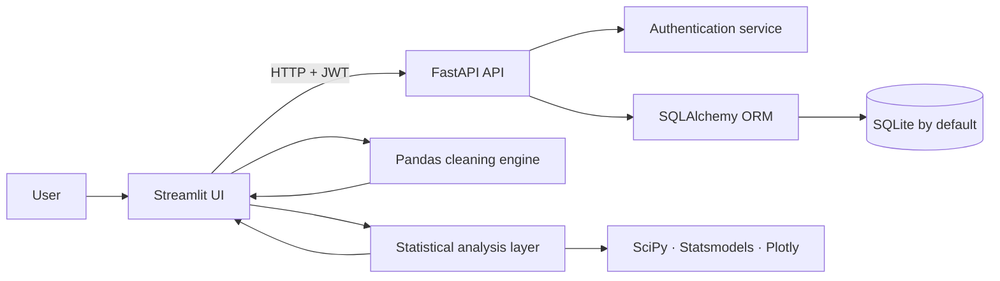
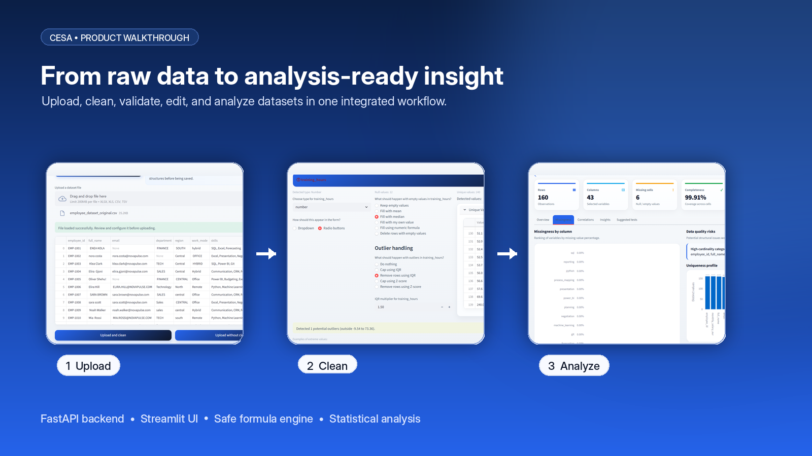
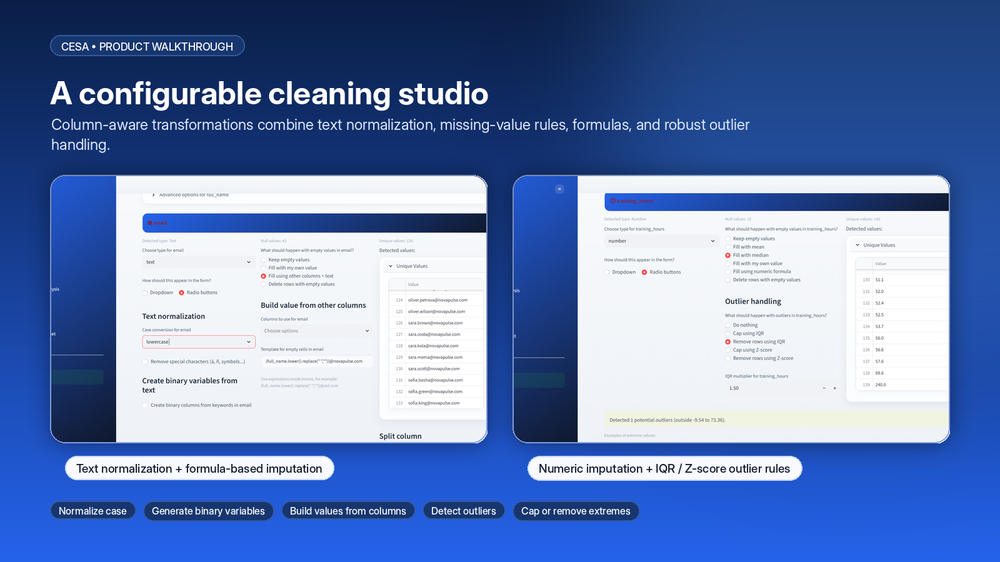
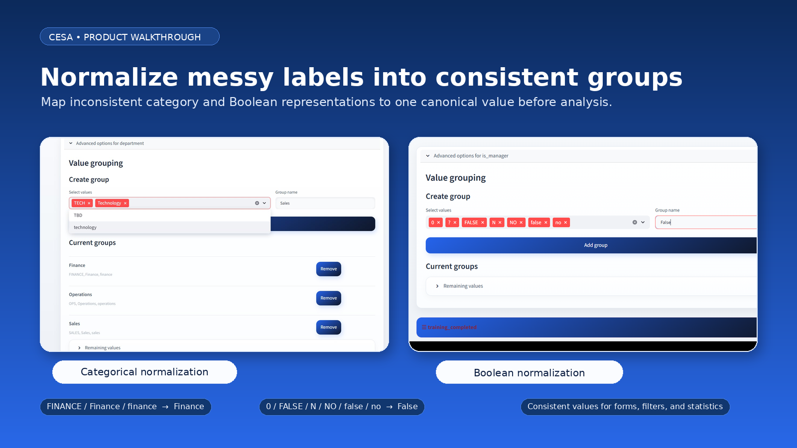
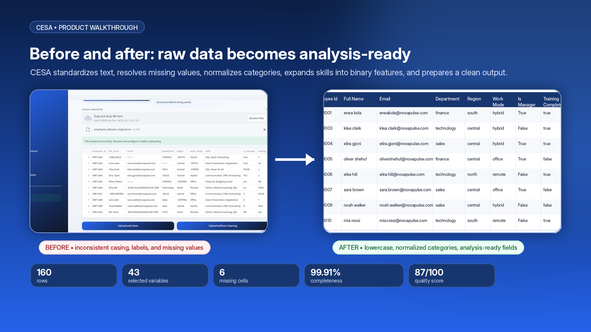
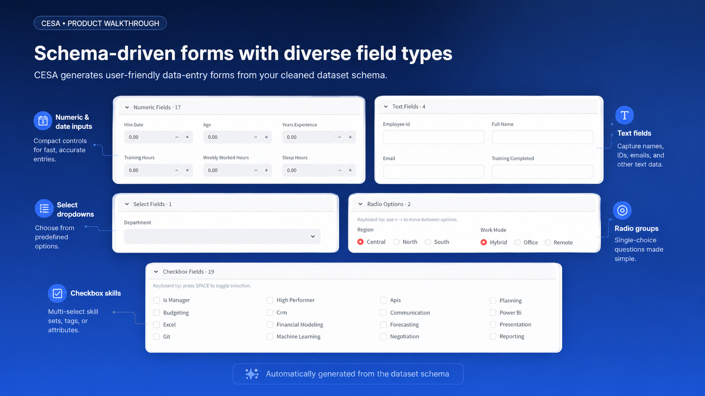
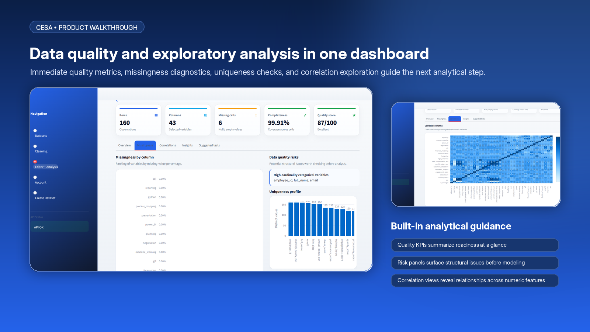
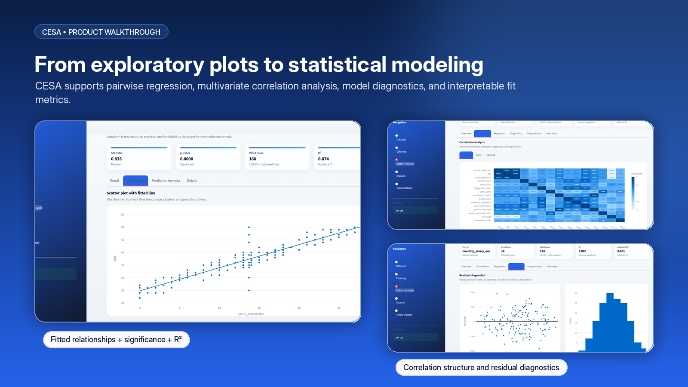
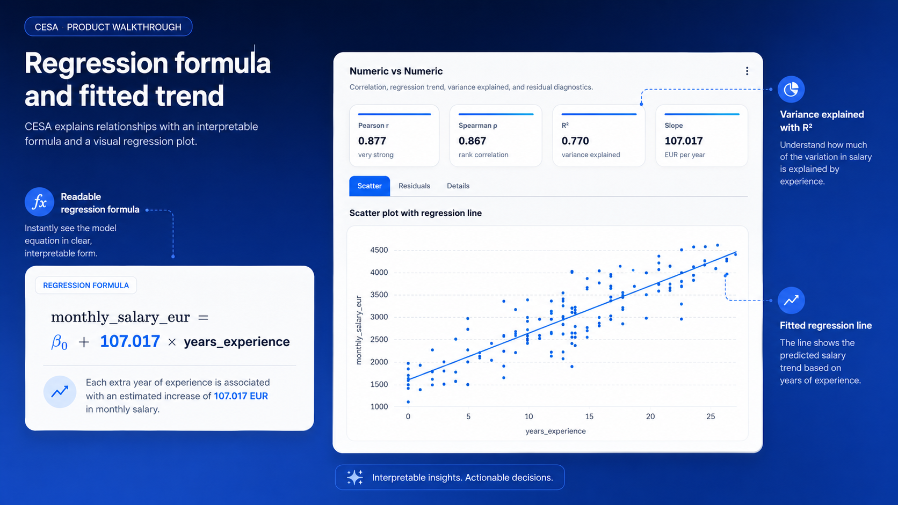
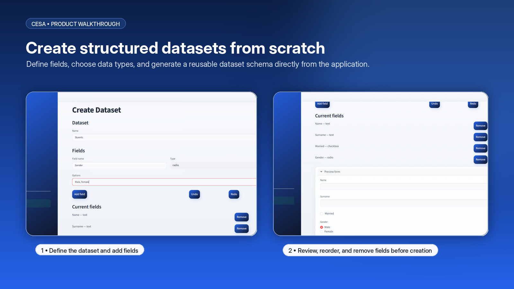

<div align="center">
  

  # CESA

  **A full-stack workspace for building, cleaning, managing, and statistically exploring structured datasets.**

  [](https://www.python.org/)
  [](https://fastapi.tiangolo.com/)
  [](https://streamlit.io/)
  [](https://pandas.pydata.org/)
  [](https://www.sqlalchemy.org/)
  [](https://plotly.com/python/)

  <p>
    Upload or create a dataset, configure a reproducible cleaning pipeline, generate a schema-aware data-entry form, edit records, run guided statistical analyses, and export the result—all in one application.
  </p>
</div>

---

## Why CESA?

Data work is rarely just a single chart or a single cleaning script. A useful workflow must connect **data ingestion, quality control, editing, analysis, and persistence** without losing the structure of the dataset between steps.

CESA brings those stages together in one cohesive application:

```text
Create or upload → Profile → Clean → Generate form schema → Edit → Analyze → Export
```

It combines a polished **Streamlit interface** with a secured **FastAPI API**, a configurable **Pandas cleaning engine**, and a broad statistical-analysis layer powered by **SciPy**, **Statsmodels**, and **Plotly**.

---

## Core highlights

| Capability | What CESA provides |
|---|---|
| **Flexible data ingestion** | Create a dataset from scratch or upload `.xlsx`, `.xls`, `.csv`, and `.tsv` files. |
| **Schema-aware cleaning** | Infer column types, configure null handling, normalize booleans, replace values, split text, create multi-hot indicators, and manage numeric outliers. |
| **Safe formula engine** | Build numeric, boolean, and text values from other columns through an AST-based allow-listed evaluator—without Python `eval()`. |
| **Dynamic form generation** | Transform the cleaned dataset schema into typed inputs such as text, number, date, checkbox, radio, and select fields. |
| **Dataset workspace** | Add records, search, filter, edit cells, save changes, reload server state, and export to Excel. |
| **Guided analytics** | Explore overview, univariate, bivariate, three-variable, multivariate, and hypothesis-testing workflows. |
| **Secure persistence** | JWT authentication, hashed passwords, user-scoped datasets, environment-based secrets, and SQLAlchemy persistence. |

---

## End-to-end workflow

### 1. Create or upload

CESA supports two entry points:

- **Create from scratch:** define the dataset name, fields, field types, and selectable options; preview the generated form; and use undo/redo while designing the schema.
- **Upload existing data:** import Excel, CSV, or TSV data, detect duplicate columns, inspect a preview, and choose whether to clean it before saving.

Supported upload formats:

```text
.xlsx   .xls   .csv   .tsv
```

CSV and TSV ingestion includes fallback handling for common encodings such as UTF-8, Windows-1252, and Latin-1.

### 2. Profile and clean

Each column is profiled and assigned a suggested type. CESA can work with:

```text
Text · Number · Category · Boolean · Date
```

The cleaning interface provides column-level controls for:

- Missing values: keep, remove rows, fill manually, use mean/median/mode, or calculate a value from other columns.
- Numeric outliers: cap or remove using **IQR** or **Z-score** rules.
- Boolean normalization: map multilingual yes/no-style values to `True` and `False`.
- Value replacement: define visual or text-based replacement rules.
- Text preparation: remove special characters and split one field into multiple columns.
- Multi-hot encoding: detect configured keywords in free text and create boolean indicator columns.
- Categorical form behavior: generate dropdowns or radio-button fields from existing or manually defined values.

Before saving, CESA shows both a **cleaned-data preview** and the **generated form schema**.

### 3. Generate a typed data-entry form

The final cleaning configuration is translated into reusable field metadata. New records are entered through controls that match the meaning of each column:

| Data meaning | Generated control |
|---|---|
| Free text | Text input |
| Numeric value | Number input |
| Date | Date picker |
| Boolean | Checkbox |
| Small category set | Radio buttons |
| Larger category set | Select box |

This keeps data entry consistent with the cleaned dataset instead of treating every value as plain text.

### 4. Edit and manage records

The workspace includes:

- Schema-driven add-record form.
- Editable table with dynamic height and density controls.
- Global search and column-specific filtering.
- Save changes to the backend.
- Reload the latest persisted version.
- Export the active dataset to `.xlsx`.
- List and delete datasets owned by the authenticated user.

### 5. Analyze

CESA organizes analysis into six guided modules.

#### Overview

- Row and column counts.
- Missing-cell totals and missingness by column.
- Automatic numeric/categorical detection.
- Dataset quality score.
- High-cardinality and data-quality warnings.
- Correlation matrix and strongest numeric relationships.
- Suggested next analyses based on the available variable types.
- Downloadable column summary.

#### Univariate analysis

For numeric variables:

- Mean, median, standard deviation, quartiles, IQR, skewness, and kurtosis.
- Histogram and boxplot.
- IQR-based outlier screening.
- Data-completeness interpretation and recommended next steps.

For categorical variables:

- Frequency and proportion tables.
- Dominant and rare categories.
- Cardinality diagnostics.
- Bar and pie visualizations.
- Missingness-aware interpretation.

#### Bivariate analysis

CESA automatically adapts to the selected pair:

- **Numeric × numeric:** Pearson and Spearman correlation, simple linear regression, explained variance, scatter plot, and residual diagnostics.
- **Numeric × categorical:** group summaries, distribution comparisons, significance testing, and effect interpretation.
- **Categorical × categorical:** contingency tables, chi-square analysis, Cramér’s V, normalized proportions, and heatmaps.

#### Three-variable analysis

The visualization changes according to the selected variable combination:

- Two numeric variables grouped by one category.
- Three numeric variables with bubble charts and a correlation matrix.
- One numeric outcome across two categorical dimensions.
- Three-category combination and co-occurrence summaries.

#### Multivariate analysis

- Numeric correlation heatmap, table, and ranked correlation pairs.
- Multiple ordinary least squares regression.
- Coefficients, p-values, confidence intervals, R², and adjusted R².
- Residual diagnostics.
- Variance Inflation Factor (**VIF**) for multicollinearity assessment.
- Plain-language model interpretation and suggested next steps.

#### Statistical tests

- Pearson or Spearman correlation tests.
- Chi-square test of categorical association with Cramér’s V.
- Welch t-test for two-group numeric comparisons.
- One-way ANOVA for three or more groups.
- Effect-size summaries and data-readiness warnings.
- Simple prediction formulas where the selected method supports them.

---

##  Security-focused design

CESA includes several safeguards that are especially important for a data application:

- Passwords are hashed using Passlib and bcrypt.
- API access is protected by JWT bearer tokens.
- Every dataset operation is scoped to the authenticated user.
- `SECRET_KEY` is loaded from the environment and the backend refuses to start with a missing, placeholder, or weak key.
- Formula input is parsed with Python's AST and evaluated through an explicit allow-list instead of `eval()`.
- Private attributes, imports, lambdas, arbitrary function calls, and other unsafe expression patterns are rejected.

Examples of supported formula styles:

```text
Numeric:  {salary} + {bonus}
Boolean:  {age} >= 18 and {active} == True
Text:     {full_name.lower().replace(" ", "")}@example.com
```

---

##  Architecture



### Main technologies

| Layer | Technologies |
|---|---|
| Frontend | Streamlit, custom CSS |
| Backend | FastAPI, Pydantic, Uvicorn |
| Data processing | Pandas, NumPy |
| Statistics | SciPy, Statsmodels |
| Visualization | Plotly, Matplotlib |
| Persistence | SQLAlchemy, SQLite by default |
| Authentication | JWT, Passlib, bcrypt |
| File handling | OpenPyXL, xlrd |

---

## 📁 Project structure

```text
CESA/
├── backend/
│   ├── core/                 # Shared calculations
│   ├── routers/              # Authentication, datasets, and statistics API
│   ├── app.py                # FastAPI application
│   ├── auth.py               # Password hashing and JWT handling
│   ├── db.py                 # SQLAlchemy configuration
│   ├── deps.py               # Authenticated-user dependency
│   ├── models.py             # Database models
│   └── schemas.py            # API schemas
├── frontend/
│   ├── api/                  # Backend client functions
│   ├── components/           # Forms, table, cleaning, charts, analysis
│   ├── constants/            # Navigation constants
│   ├── pages/                # Streamlit pages
│   ├── services/             # Cleaning, dataset, statistics services
│   ├── utils/                # Session and UI helpers
│   ├── icon.png
│   ├── streamlit_app.py      # Streamlit entry point
│   └── styles.css            # Application styling
├── .env.example              # Environment template without secrets
├── .gitignore
└── requirements.txt
```

---

## Local setup

### Prerequisites

- A recent Python 3 installation.
- `pip`.
- Two terminal windows: one for FastAPI and one for Streamlit.

### 1. Clone the repository

```bash
git clone <your-repository-url>
cd CESA
```

### 2. Create and activate a virtual environment

**Windows PowerShell**

```powershell
python -m venv .venv
.\.venv\Scripts\Activate.ps1
```

**macOS / Linux**

```bash
python3 -m venv .venv
source .venv/bin/activate
```

### 3. Install dependencies

```bash
pip install -r requirements.txt
```

### 4. Configure the environment

Copy the public template:

**Windows PowerShell**

```powershell
Copy-Item .env.example .env
```

**macOS / Linux**

```bash
cp .env.example .env
```

Generate a secure key:

```bash
python -c "import secrets; print(secrets.token_urlsafe(64))"
```

Place it in `.env`:

```dotenv
SECRET_KEY=replace_this_with_the_generated_secret
ACCESS_TOKEN_EXPIRE_MINUTES=1440
DATABASE_URL=sqlite:///./app.db
API_URL=http://127.0.0.1:8000
```

> Never commit `.env`. Only `.env.example` belongs in the repository.

### 5. Start the API

```bash
uvicorn backend.app:app --reload
```

The API will be available at:

```text
http://127.0.0.1:8000
```

Interactive API documentation:

```text
http://127.0.0.1:8000/docs
```

### 6. Start the Streamlit interface

Open a second terminal, activate the same environment, and run:

```bash
streamlit run frontend/streamlit_app.py
```

The application will normally open at:

```text
http://localhost:8501
```

---

## API overview

| Method | Endpoint | Purpose |
|---|---|---|
| `POST` | `/auth/signup` | Create an account |
| `POST` | `/auth/login` | Receive a JWT access token |
| `GET` | `/dataset` | List the current user's datasets |
| `POST` | `/dataset/create` | Create an empty schema-driven dataset |
| `POST` | `/dataset/upload` | Upload an XLSX, XLS, CSV, or TSV dataset |
| `GET` | `/dataset/{id}` | Load one owned dataset |
| `POST` | `/dataset/{id}/update` | Persist edited rows |
| `GET` | `/dataset/{id}/export` | Export the dataset to Excel |
| `GET` | `/dataset/{id}/meta` | Retrieve dataset field metadata |
| `DELETE` | `/dataset/{id}` | Delete an owned dataset |
| `POST` | `/stats/{id}` | Request basic server-side statistics |
| `GET` | `/health` | Check API availability |

Protected dataset endpoints require:

```http
Authorization: Bearer <access-token>
```

---

##  Screenshots

## Product Walkthrough

CESA provides an end-to-end workflow for importing raw datasets, configuring cleaning rules, generating schema-driven forms, editing records, and performing statistical analysis.

---

### 1. End-to-end data workflow

CESA connects the complete data preparation process in one application: upload a raw dataset, inspect its structure, apply transformations, preview the result, and continue directly into editing and analysis.



---

### 2. Configurable cleaning studio

The cleaning interface supports dataset-level and column-level transformations, including missing-value handling, text normalization, formula-based completion, outlier treatment, row filtering, and derived columns.



---

### 3. Value grouping and Boolean normalization

CESA can consolidate inconsistent representations into canonical groups before analysis.

Examples include:

- `FINANCE`, `Finance`, and `finance` → `Finance`
- `0`, `FALSE`, `N`, `NO`, `false`, and `no` → `False`

This produces consistent values for forms, filters, calculations, and statistical models.



---

### 4. Before and after cleaning

The preview workflow makes every transformation visible before the cleaned dataset is saved.

Raw values can be standardized, missing values imputed, inconsistent text normalized, and analytical variables generated from the original columns.



---

### 5. Schema-driven forms with diverse field types

CESA automatically generates data-entry forms from the cleaned dataset schema.

The generated interface supports:

- numeric and date inputs;
- text and email fields;
- dropdown selections;
- radio-button groups;
- Boolean and skill checkboxes.

This allows users to add new records without manually designing a form for every dataset.



---

### 6. Data-quality and exploratory analysis

CESA summarizes the analytical readiness of a dataset through quality indicators, missing-value analysis, column profiling, risk detection, and correlation exploration.



---

### 7. Statistical modeling and diagnostics

The analysis workspace supports correlation analysis, multivariate modeling, fitted relationships, and residual diagnostics.

These views help users evaluate both model performance and the assumptions behind the results.



---

### 8. Interpretable regression analysis

CESA presents regression results through both a visual fitted trend and a readable model equation.

The interface displays correlation strength, variance explained, slope, and the practical interpretation of the estimated relationship.



---

### 9. Dataset builder

CESA can also create structured datasets from scratch. Users define the fields and their data types, generate a schema-driven form, and begin adding records immediately.


---

## Future improvements

- Automated test suite for API, cleaning rules, and statistical calculations.
- Database migrations with Alembic.
- Docker-based local setup and deployment.
- Additional export formats and saved cleaning recipes.
- Role-based access and dataset sharing.
- Larger-file processing and background jobs.

---

<div align="center">
  <strong>CESA turns a raw table into a structured, editable, and analyzable dataset through one connected workflow.</strong>
</div>
