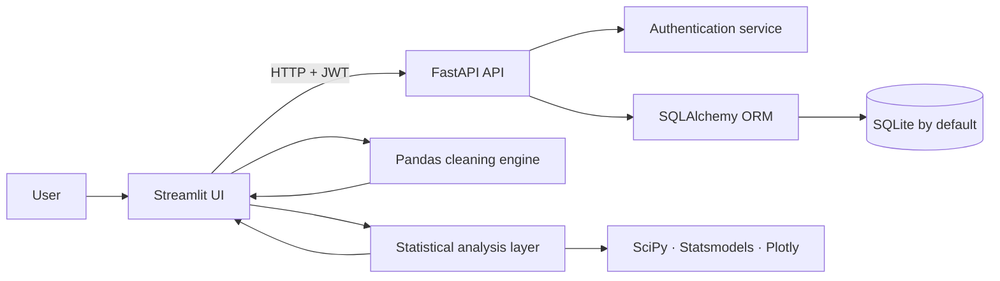

<div align="center">
  

  # CESA

  **A full-stack workspace for building, cleaning, managing, and statistically exploring structured datasets.**

  [](https://www.python.org/)
  [](https://fastapi.tiangolo.com/)
  [](https://streamlit.io/)
  [](https://pandas.pydata.org/)
  [](https://www.sqlalchemy.org/)
  [](https://plotly.com/python/)

  <p>
    Upload or create a dataset, configure a reproducible cleaning pipeline, generate a schema-aware data-entry form, edit records, run guided statistical analyses, and export the result—all in one application.
  </p>
</div>

---

## Why CESA?

Data work is rarely just a single chart or a single cleaning script. A useful workflow must connect **data ingestion, quality control, editing, analysis, and persistence** without losing the structure of the dataset between steps.

CESA brings those stages together in one cohesive application:

```text
Create or upload → Profile → Clean → Generate form schema → Edit → Analyze → Export
```

It combines a polished **Streamlit interface** with a secured **FastAPI API**, a configurable **Pandas cleaning engine**, and a broad statistical-analysis layer powered by **SciPy**, **Statsmodels**, and **Plotly**.

---

## Core highlights

| Capability | What CESA provides |
|---|---|
| **Flexible data ingestion** | Create a dataset from scratch or upload `.xlsx`, `.xls`, `.csv`, and `.tsv` files. |
| **Schema-aware cleaning** | Infer column types, configure null handling, normalize booleans, replace values, split text, create multi-hot indicators, and manage numeric outliers. |
| **Safe formula engine** | Build numeric, boolean, and text values from other columns through an AST-based allow-listed evaluator—without Python `eval()`. |
| **Dynamic form generation** | Transform the cleaned dataset schema into typed inputs such as text, number, date, checkbox, radio, and select fields. |
| **Dataset workspace** | Add records, search, filter, edit cells, save changes, reload server state, and export to Excel. |
| **Guided analytics** | Explore overview, univariate, bivariate, three-variable, multivariate, and hypothesis-testing workflows. |
| **Secure persistence** | JWT authentication, hashed passwords, user-scoped datasets, environment-based secrets, and SQLAlchemy persistence. |

---

## End-to-end workflow

### 1. Create or upload

CESA supports two entry points:

- **Create from scratch:** define the dataset name, fields, field types, and selectable options; preview the generated form; and use undo/redo while designing the schema.
- **Upload existing data:** import Excel, CSV, or TSV data, detect duplicate columns, inspect a preview, and choose whether to clean it before saving.

Supported upload formats:

```text
.xlsx   .xls   .csv   .tsv
```

CSV and TSV ingestion includes fallback handling for common encodings such as UTF-8, Windows-1252, and Latin-1.

### 2. Profile and clean

Each column is profiled and assigned a suggested type. CESA can work with:

```text
Text · Number · Category · Boolean · Date
```

The cleaning interface provides column-level controls for:

- Missing values: keep, remove rows, fill manually, use mean/median/mode, or calculate a value from other columns.
- Numeric outliers: cap or remove using **IQR** or **Z-score** rules.
- Boolean normalization: map multilingual yes/no-style values to `True` and `False`.
- Value replacement: define visual or text-based replacement rules.
- Text preparation: remove special characters and split one field into multiple columns.
- Multi-hot encoding: detect configured keywords in free text and create boolean indicator columns.
- Categorical form behavior: generate dropdowns or radio-button fields from existing or manually defined values.

Before saving, CESA shows both a **cleaned-data preview** and the **generated form schema**.

### 3. Generate a typed data-entry form

The final cleaning configuration is translated into reusable field metadata. New records are entered through controls that match the meaning of each column:

| Data meaning | Generated control |
|---|---|
| Free text | Text input |
| Numeric value | Number input |
| Date | Date picker |
| Boolean | Checkbox |
| Small category set | Radio buttons |
| Larger category set | Select box |

This keeps data entry consistent with the cleaned dataset instead of treating every value as plain text.

### 4. Edit and manage records

The workspace includes:

- Schema-driven add-record form.
- Editable table with dynamic height and density controls.
- Global search and column-specific filtering.
- Save changes to the backend.
- Reload the latest persisted version.
- Export the active dataset to `.xlsx`.
- List and delete datasets owned by the authenticated user.

### 5. Analyze

CESA organizes analysis into six guided modules.

#### Overview

- Row and column counts.
- Missing-cell totals and missingness by column.
- Automatic numeric/categorical detection.
- Dataset quality score.
- High-cardinality and data-quality warnings.
- Correlation matrix and strongest numeric relationships.
- Suggested next analyses based on the available variable types.
- Downloadable column summary.

#### Univariate analysis

For numeric variables:

- Mean, median, standard deviation, quartiles, IQR, skewness, and kurtosis.
- Histogram and boxplot.
- IQR-based outlier screening.
- Data-completeness interpretation and recommended next steps.

For categorical variables:

- Frequency and proportion tables.
- Dominant and rare categories.
- Cardinality diagnostics.
- Bar and pie visualizations.
- Missingness-aware interpretation.

#### Bivariate analysis

CESA automatically adapts to the selected pair:

- **Numeric × numeric:** Pearson and Spearman correlation, simple linear regression, explained variance, scatter plot, and residual diagnostics.
- **Numeric × categorical:** group summaries, distribution comparisons, significance testing, and effect interpretation.
- **Categorical × categorical:** contingency tables, chi-square analysis, Cramér’s V, normalized proportions, and heatmaps.

#### Three-variable analysis

The visualization changes according to the selected variable combination:

- Two numeric variables grouped by one category.
- Three numeric variables with bubble charts and a correlation matrix.
- One numeric outcome across two categorical dimensions.
- Three-category combination and co-occurrence summaries.

#### Multivariate analysis

- Numeric correlation heatmap, table, and ranked correlation pairs.
- Multiple ordinary least squares regression.
- Coefficients, p-values, confidence intervals, R², and adjusted R².
- Residual diagnostics.
- Variance Inflation Factor (**VIF**) for multicollinearity assessment.
- Plain-language model interpretation and suggested next steps.

#### Statistical tests

- Pearson or Spearman correlation tests.
- Chi-square test of categorical association with Cramér’s V.
- Welch t-test for two-group numeric comparisons.
- One-way ANOVA for three or more groups.
- Effect-size summaries and data-readiness warnings.
- Simple prediction formulas where the selected method supports them.

---

##  Security-focused design

CESA includes several safeguards that are especially important for a data application:

- Passwords are hashed using Passlib and bcrypt.
- API access is protected by JWT bearer tokens.
- Every dataset operation is scoped to the authenticated user.
- `SECRET_KEY` is loaded from the environment and the backend refuses to start with a missing, placeholder, or weak key.
- Formula input is parsed with Python's AST and evaluated through an explicit allow-list instead of `eval()`.
- Private attributes, imports, lambdas, arbitrary function calls, and other unsafe expression patterns are rejected.

Examples of supported formula styles:

```text
Numeric:  {salary + bonus}
Boolean:  {age >= 18 and active == True}
Text:     {full_name.lower().replace(" ", "")}@example.com
```

---

##  Architecture



### Main technologies

| Layer | Technologies |
|---|---|
| Frontend | Streamlit, custom CSS |
| Backend | FastAPI, Pydantic, Uvicorn |
| Data processing | Pandas, NumPy |
| Statistics | SciPy, Statsmodels |
| Visualization | Plotly, Matplotlib |
| Persistence | SQLAlchemy, SQLite by default |
| Authentication | JWT, Passlib, bcrypt |
| File handling | OpenPyXL, xlrd |

---

## Project structure

```text
CESA/
├── backend/
│   ├── core/                 # Shared calculations
│   ├── routers/              # Authentication, datasets, and statistics API
│   ├── app.py                # FastAPI application
│   ├── auth.py               # Password hashing and JWT handling
│   ├── db.py                 # SQLAlchemy configuration
│   ├── deps.py               # Authenticated-user dependency
│   ├── models.py             # Database models
│   └── schemas.py            # API schemas
├── frontend/
│   ├── api/                  # Backend client functions
│   ├── components/           # Forms, table, cleaning, charts, analysis
│   ├── constants/            # Navigation constants
│   ├── pages/                # Streamlit pages
│   ├── services/             # Cleaning, dataset, statistics services
│   ├── utils/                # Session and UI helpers
│   ├── icon.png
│   ├── streamlit_app.py      # Streamlit entry point
│   └── styles.css            # Application styling
├── .env.example              # Environment template without secrets
├── .gitignore
└── requirements.txt
```

---

## Local setup

### Prerequisites

- A recent Python 3 installation.
- `pip`.
- Two terminal windows: one for FastAPI and one for Streamlit.

### 1. Clone the repository

```bash
git clone <https://github.com/emanellari/CESA>
cd CESA
```

### 2. Create and activate a virtual environment

**Windows PowerShell**

```powershell
python -m venv .venv
.\.venv\Scripts\Activate.ps1
```

**macOS / Linux**

```bash
python3 -m venv .venv
source .venv/bin/activate
```

### 3. Install dependencies

```bash
pip install -r requirements.txt
```

### 4. Configure the environment

Copy the public template:

**Windows PowerShell**

```powershell
Copy-Item .env.example .env
```

**macOS / Linux**

```bash
cp .env.example .env
```

Generate a secure key:

```bash
python -c "import secrets; print(secrets.token_urlsafe(64))"
```

Place it in `.env`:

```dotenv
SECRET_KEY=replace_this_with_the_generated_secret
ACCESS_TOKEN_EXPIRE_MINUTES=1440
DATABASE_URL=sqlite:///./app.db
API_URL=http://127.0.0.1:8000
```

> Never commit `.env`. Only `.env.example` belongs in the repository.

### 5. Start the API

```bash
uvicorn backend.app:app --reload
```

The API will be available at:

```text
http://127.0.0.1:8000
```

Interactive API documentation:

```text
http://127.0.0.1:8000/docs
```

### 6. Start the Streamlit interface

Open a second terminal, activate the same environment, and run:

```bash
streamlit run frontend/streamlit_app.py
```

The application will normally open at:

```text
http://localhost:8501
```

---

## API overview

| Method | Endpoint | Purpose |
|---|---|---|
| `POST` | `/auth/signup` | Create an account |
| `POST` | `/auth/login` | Receive a JWT access token |
| `GET` | `/dataset` | List the current user's datasets |
| `POST` | `/dataset/create` | Create an empty schema-driven dataset |
| `POST` | `/dataset/upload` | Upload an XLSX, XLS, CSV, or TSV dataset |
| `GET` | `/dataset/{id}` | Load one owned dataset |
| `POST` | `/dataset/{id}/update` | Persist edited rows |
| `GET` | `/dataset/{id}/export` | Export the dataset to Excel |
| `GET` | `/dataset/{id}/meta` | Retrieve dataset field metadata |
| `DELETE` | `/dataset/{id}` | Delete an owned dataset |
| `POST` | `/stats/{id}` | Request basic server-side statistics |
| `GET` | `/health` | Check API availability |

Protected dataset endpoints require:

```http
Authorization: Bearer <access-token>
```

---

## Interactive Application Demonstrations

The following demonstrations present the main CESA workflows as complete user journeys.

Instead of displaying isolated screenshots, these GIFs show how users interact with the platform, how data moves between modules, and how CESA supports the complete data lifecycle: authentication, structured data collection, record management, cleaning, editing, and statistical analysis.

Each demonstration includes contextual explanations while preserving the visibility of the original application interface.

---

## 1. Authentication and User Session Flow

CESA includes a complete authentication system that separates public access from the authenticated user workspace.

This flow demonstrates how a new user can create an account, log into the platform, access protected functionality, close the active session, and securely return through the login process.

### Workflow shown

1. The user opens the registration page.
2. Account information is entered.
3. Registration data is validated.
4. A new user account is created.
5. The authenticated workspace becomes available.
6. The user logs out of the active session.
7. Access to protected functionality is closed.
8. The user logs in again using the registered credentials.

### Functionalities demonstrated

- User registration
- Credential validation
- Secure login
- Authenticated session creation
- Protected workspace access
- User logout
- Session-state management
- Navigation between authentication screens

### Why this matters

The authentication layer allows CESA to operate as a multi-user application instead of a single local data tool.

Each user enters the platform through an individual account and works inside a controlled session. This provides the foundation for separating personal forms, uploaded datasets, saved records, and cleaning configurations.

<p align="center">
  
</p>

---

## 2. Dynamic Form Creation, Record Storage and Analysis

CESA allows users to create structured data-entry forms directly from the application.

Instead of manually creating database tables or editing spreadsheets, users define the structure of the information through the interface. CESA then generates the corresponding form fields and provides a workspace for entering, saving, reviewing, and analysing records.

### Workflow shown

1. A new form is created.
2. The form name and structure are configured.
3. Columns and field types are defined.
4. The generated form becomes available for data entry.
5. The user enters a new record.
6. Input values are validated according to the configured field types.
7. The record is saved.
8. Stored data is displayed inside the workspace.
9. The dataset becomes available for review and analysis.

### Functionalities demonstrated

- Dynamic form generation
- Schema configuration
- Typed field creation
- Data-entry validation
- Record persistence
- Dataset creation
- Saved-record preview
- Record review
- Transition from data collection to analysis

### Why this matters

This workflow connects data collection directly with downstream analysis.

Users do not need to move manually between a form builder, spreadsheet, database editor, and separate analytics tool. CESA keeps the complete process inside one connected application.

The same information entered through the generated form can later be edited, cleaned, filtered, explored, and statistically analysed.

<p align="center">
  
</p>

---

##  3. Configurable Data-Cleaning Workflow

The cleaning module allows users to prepare raw datasets through an interactive, column-aware configuration process.

Instead of applying the same rule to the entire dataset, CESA lets users choose transformations according to the type, content, and condition of each column.

The demonstration preserves the original interaction speed so that every selection, transformation, and result remains visible.

### Workflow shown

1. A dataset is opened in the cleaning workspace.
2. The user reviews the original values and data types.
3. Cleaning options are configured for selected columns.
4. Different strategies are applied according to each column type.
5. The cleaning process is executed.
6. A transformed dataset is generated.
7. Original and cleaned values are compared.
8. The user reviews the final result before saving or continuing to analysis.

### Missing-value handling

CESA supports different null-value strategies depending on the column type and the intended analysis.

Available approaches can include:

- Filling numeric nulls with a calculated value
- Replacing missing categorical values
- Replacing missing boolean values
- Applying a custom replacement value
- Preserving null values when no transformation is required
- Applying formula-based replacement rules

### Text transformations

Text columns can be standardised using operations such as:

- Lowercase conversion
- Uppercase conversion
- Title case conversion
- Text trimming
- Whitespace normalisation
- Standardised formatting
- Custom text formulas

### Numeric cleaning

Numeric columns can be processed using configurable operations such as:

- Missing-value replacement
- Formula-based transformations
- Value capping
- Outlier detection
- IQR-based outlier handling
- Z-score-based outlier handling
- Numeric validation
- Range correction

### Boolean, categorical and date preparation

The cleaning workflow can also include:

- Boolean-value normalisation
- Categorical-value standardisation
- Date parsing and preparation
- Data-type-aware cleaning strategies
- Column-level configuration
- Preview of transformed values
- Validation before saving the cleaned dataset

### Before-and-after comparison

CESA keeps the original and transformed data visible so that users can understand the effect of each cleaning configuration.

This makes it possible to review:

- Which values were modified
- Which missing values were replaced
- Which text values were standardised
- Which outliers were capped or corrected
- Whether column types remain consistent
- Whether the resulting dataset is ready for analysis

### Why this matters

Data cleaning is not treated as a hidden automatic operation.

CESA exposes the cleaning configuration to the user, making each transformation understandable, reviewable, and reproducible. This is especially important when preparing information for statistical analysis or machine-learning workflows, where an incorrect transformation can significantly affect the final result.

### Before-and-after Excel examples

The repository includes Excel files that demonstrate the effect of the cleaning process on a complete example dataset.

These files allow reviewers to inspect the actual data before and after applying the cleaning configuration, rather than relying only on the visual demonstration.

The examples can be found in:

```text
examples/cleaning/
```

Recommended repository structure:

```text
examples/cleaning/
├── dataset_before_cleaning.xlsx
├── dataset_after_cleaning.xlsx
└── cleaning_comparison.md
```

#### Original dataset

[`dataset_before_cleaning.xlsx`](examples/cleaning/dataset_before_cleaning.xlsx)

This file contains the original unprocessed dataset before any cleaning operations are applied.

It can include examples such as:

- Missing numeric values
- Missing categorical values
- Inconsistent boolean formats
- Irregular text capitalisation
- Extra whitespace
- Invalid or inconsistent date formats
- Extreme numeric values
- Outliers
- Inconsistent categorical labels

#### Cleaned dataset

[`dataset_after_cleaning.xlsx`](examples/cleaning/dataset_after_cleaning.xlsx)

This file contains the resulting dataset after the cleaning configuration has been executed through CESA.

It demonstrates changes such as:

- Filled or preserved missing values
- Standardised text formatting
- Normalised boolean values
- Corrected categorical labels
- Prepared date values
- Capped or treated outliers
- Formula-based numeric transformations
- Improved consistency across columns

#### Cleaning documentation

[`cleaning_comparison.md`](examples/cleaning/cleaning_comparison.md)

This document explains the main differences between the original and cleaned datasets.

It can describe:

- The rule applied to each column
- The original issue detected
- The cleaning strategy selected
- The resulting transformation
- The reason for applying the change
- The expected effect on future analysis

### Example comparison structure

| Column | Original issue | Cleaning operation | Result |
|---|---|---|---|
| `age` | Missing numeric values | Filled using the selected numeric strategy | Complete numeric column |
| `active` | Mixed boolean formats | Boolean normalisation | Consistent `True` / `False` values |
| `category` | Inconsistent labels | Categorical standardisation | Unified categories |
| `product_name` | Irregular capitalisation and spaces | Text trimming and title case | Standardised product names |
| `salary` | Extreme values | IQR or Z-score-based treatment | Reduced outlier impact |
| `registration_date` | Mixed date formats | Date parsing | Consistent date representation |

These files allow users and reviewers to verify the cleaning output directly and understand how CESA transforms raw data into an analysis-ready dataset.

<p align="center">
  
</p>

---

## 4. Guided Dataset Editing and Platform Navigation

CESA provides a guided workflow for reviewing and editing records directly inside the workspace.

This demonstration uses phase indicators and contextual captions to explain the current operation without covering the original application content.

The purpose is to show how users move through the platform and how the different modules form part of the same connected data workflow.

### Workflow shown

1. The user navigates to the dataset workspace.
2. Existing records are displayed.
3. A specific record is selected.
4. Stored values are reviewed.
5. Record information is edited.
6. The changes are submitted.
7. The dataset is updated.
8. The user continues to the next stage of the workflow.

### Functionalities demonstrated

- Dataset navigation
- Record visualisation
- Direct record editing
- Structured workspace interaction
- Data update flow
- Movement between application modules
- Phase-based guidance
- Contextual interface explanations

### Guided presentation

The demonstration includes:

- A visible phase number
- The name of the current operation
- A short explanation of the objective
- Progress indicators
- Supporting subtitles positioned below the application
- Unobstructed visibility of the original interface

### Why this matters

The editing interface allows users to correct or update stored information without directly accessing the database.

This makes CESA more suitable for non-technical users while preserving a structured and controlled data-management process.

<p align="center">
  
</p>

---

## Complete CESA Data Workflow

Together, the demonstrations represent the main application lifecycle:

```text
User registration
        ↓
Secure login
        ↓
Form and schema creation
        ↓
Structured data entry
        ↓
Record storage
        ↓
Dataset review and editing
        ↓
Data cleaning and transformation
        ↓
Before-and-after validation
        ↓
Exploratory and statistical analysis
```

CESA is designed to connect all these stages inside a single platform.

Rather than providing isolated scripts for cleaning or analysis, the application combines:

- User authentication
- Dynamic form generation
- Structured data collection
- Database-backed record management
- Dataset editing
- Configurable preprocessing
- Before-and-after validation
- Data visualisation
- Statistical analysis

This allows users to move from raw information to analysis-ready data through one consistent interface.

---

## Demonstration Notes

- The GIFs preserve the original interaction pace.
- Important clicks and interface transitions remain visible.
- Explanations are synchronised with the actions shown on screen.
- Captions are positioned so that they do not hide relevant application content.
- Cleaning demonstrations include visible before-and-after context.
- Excel examples allow direct inspection of the original and transformed datasets.
- The demonstrations focus on complete platform workflows rather than static interface previews.

---
## Future improvements

- Automated test suite for API, cleaning rules, and statistical calculations.
- Database migrations with Alembic.
- Docker-based local setup and deployment.
- Additional export formats and saved cleaning recipes.
- Role-based access and dataset sharing.
- Larger-file processing and background jobs.

---

<div align="center">
  <strong>CESA turns a raw table into a structured, editable, and analyzable dataset through one connected workflow.</strong>
</div>
